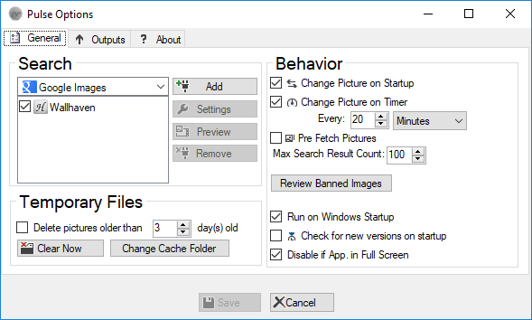

# Pulse
Forked from [https://archive.codeplex.com/?p=pulse](https://archive.codeplex.com/?p=pulse)

### Description:
Pulse is an application that automatically changes your wallpaper by downloading images from the Internet. You choose the search options.

### Screenshot

### Articles
[guidingtech.com](https://www.guidingtech.com/10320/automatically-download-wallpapers-natgeo-google-images-wallbase/)
