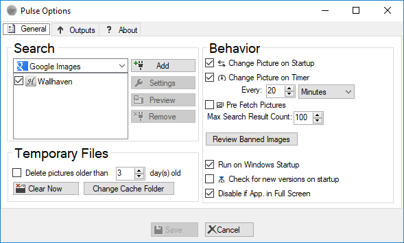

# 🌟 Pulse

> **Automatically change your wallpaper** by downloading stunning images from the internet — all driven by your own search terms.

Forked from ~~[CodePlex Archive](https://archive.codeplex.com/?p=pulse)~~ *(link broken)*

---

## ✨ Features

| Feature | Description |
|---|---|
| 🖥️ **Resolution-Aware** | Automatically picks wallpapers that match your screen resolution |
| 🚫 **Ban Wallpapers** | Ban any wallpaper you dislike — Pulse immediately fetches a fresh replacement |
| ⚡ **Smart Caching** | Search results and wallpapers are cached for fast load times |
| 📦 **Pre-Fetch** | Bulk-download all wallpapers returned by a search in one click |
| 🔄 **Auto-Change on Startup** | Wallpaper changes automatically every time Pulse launches |

---

## 🔌 Providers

Pulse uses a plugin-based provider system. **Input providers** fetch image URLs; **output providers** apply wallpapers/effects.

### 📥 Input Providers

| Provider | Source | Status | Notes |
|---|---|---|---|
| 🖼️ **Local Directory** | Local filesystem | ✅ Working | Scans a folder for images by extension |
| 📡 **Media RSS** | Any MediaRSS feed URL | ✅ Working | Works with DeviantArt and other RSS feeds |
| 🚀 **NASA APOD** | [apod.nasa.gov](https://apod.nasa.gov/apod/archivepix.html) | ✅ Working | Scrapes the Astronomy Picture of the Day archive |
| 🌍 **National Geographic** | ngm.nationalgeographic.com | ❌ Dead | Old endpoint returns 403 — needs URL update |
| 🔍 **Google Images** | images.google.com | ❌ Blocked | Google bot-detection blocks scraping |

### 📤 Output Providers

| Provider | Purpose | Status |
|---|---|---|
| 🖥️ **Wallpaper Setter** | Sets the Windows desktop wallpaper | ✅ Working |
| 🪟 **Logon Background** | Changes the Windows 7 login screen background | ⚠️ Win 7 only |
| 💎 **Aero Glass Changer** | Changes the Aero glass accent colour | ⚠️ Win 7/8 only |
| 📦 **Piler** | Saves/organises downloaded images | ✅ Working |

---

## 📥 Download

> ⚠️ **Not available right now.**

---

## 📰 Articles & Press

- [Lifehacker — *Pulse Creates Wallpaper Slideshows Based on Keywords*](https://lifehacker.com/5799438/pulse-creates-wallpaper-slideshows-based-on-keywords)
- [Redmond Pie — *Pulse for Windows 7: Changes Your Login Screen Background and Desktop Wallpaper Periodically*](https://www.redmondpie.com/pulse-for-windows-7-changes-your-login-screen-background-and-desktop-wallpaper-periodically/)
- [TV 2 Nyheder (Danish) — *Aldrig mere kedeligt Windows*](http://nyheder.tv2.dk/article/aldrig-mere-kedeligt-windows)
- [Chip.com.tr (Turkish) — *Masaüstü Resimlerini Otomatik Değiştirin*](http://www.chip.com.tr/konu/masaustu-resimlerini-otomatik-degistirin_27164.html)
- ~~[GuidingTech — *Automatically Download Wallpapers from NatGeo, Google Images & Wallbase*](https://www.guidingtech.com/10320/automatically-download-wallpapers-natgeo-google-images-wallbase/)~~ *(link broken — 404)*

---

## 🛠️ Built With

- C# / .NET (Windows Desktop App)

---

*Originally published on CodePlex. Forked and maintained here.*
